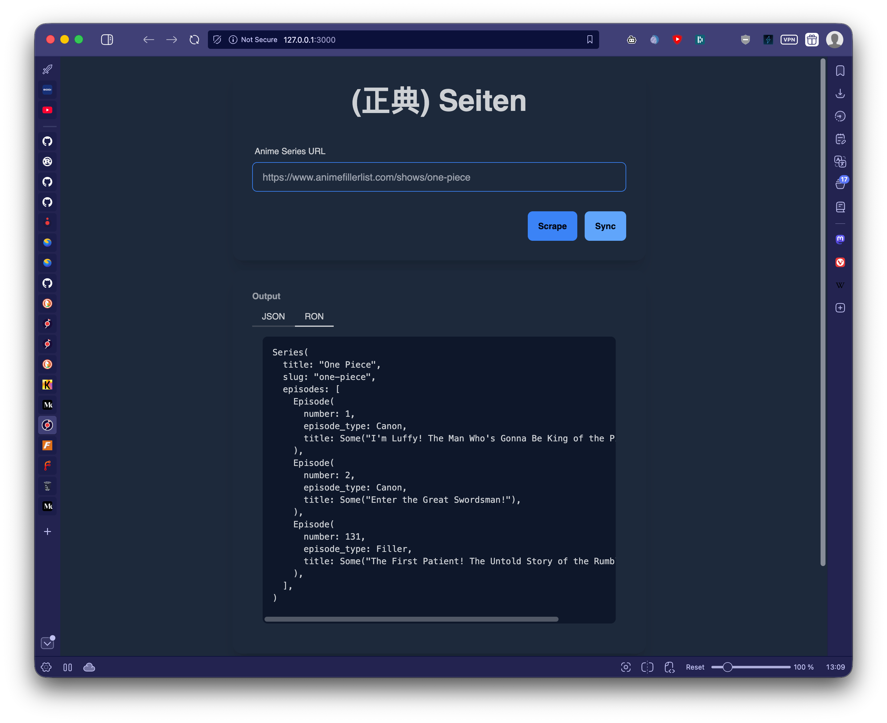

<div align="center">

# Seiten (正典)

A self-hosted tool for managing anime canon/filler collections in Plex. Seiten scrapes episode data from AnimeFillerList, caches it locally, and creates Plex collections containing only canon episodes.



**Built with:** Rust, Leptos (SSR), Axum, SeaORM, Tailwind CSS, and DaisyUI

</div>

<div align="center">

## Running the Development Server

```bash
npm install
npm run dev
```

This runs both Tailwind CSS watch and cargo-leptos watch concurrently. The app will be available at `http://127.0.0.1:3000`

## Building for Production

```bash
npm run tailwind:build
cargo leptos build --release
```

This generates:

```
Server binary in `target/server/release`
Site package in `target/site`
```

## Configuration

Create a `.env` file in the project root:

```env
DATABASE_URL=sqlite://db.sqlite?mode=rwc
# PLEX_URL=http://your-plex-server:32400
# PLEX_TOKEN=your-plex-token
```

## Project Structure

```
**app/** - Shared Leptos application code (UI components, routes)
**frontend/** - WASM frontend entry point
**server/** - Axum server with database logic
**entity/** - SeaORM entity models (Series, Episode, User)
**style/** - Tailwind CSS input/output files
```

## Licensing

Do Wat U Want.

</div>
